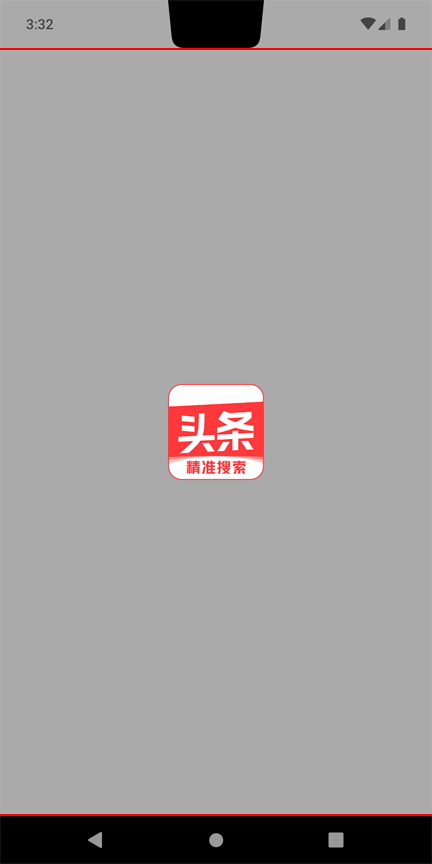
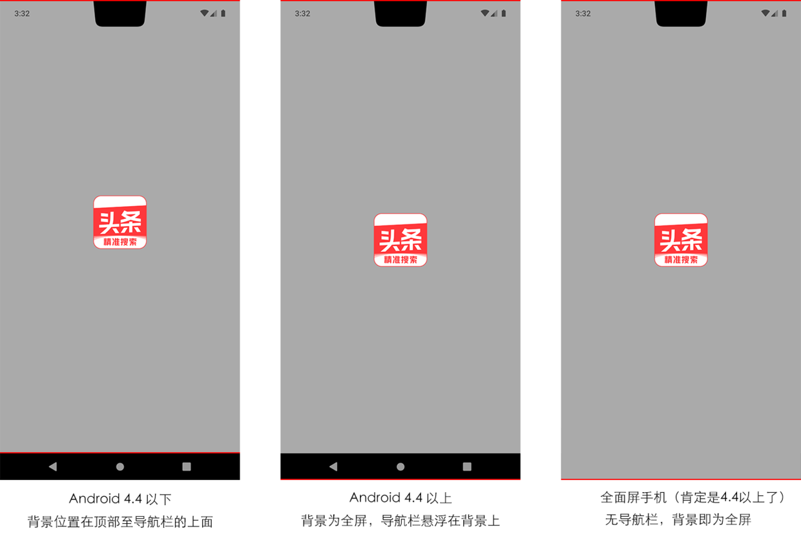
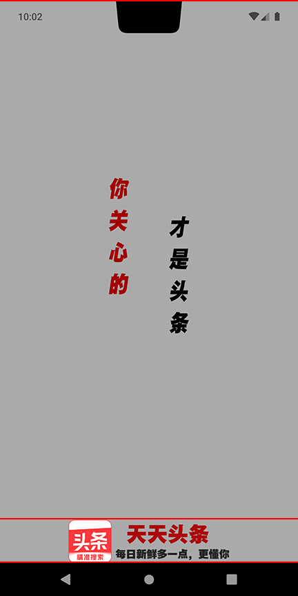
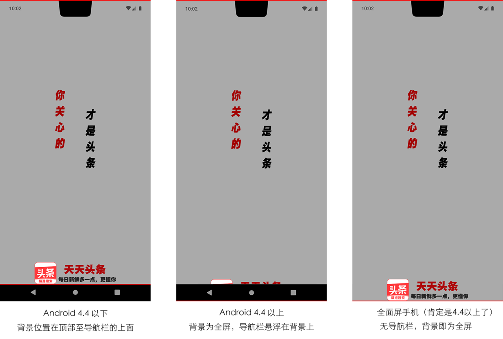
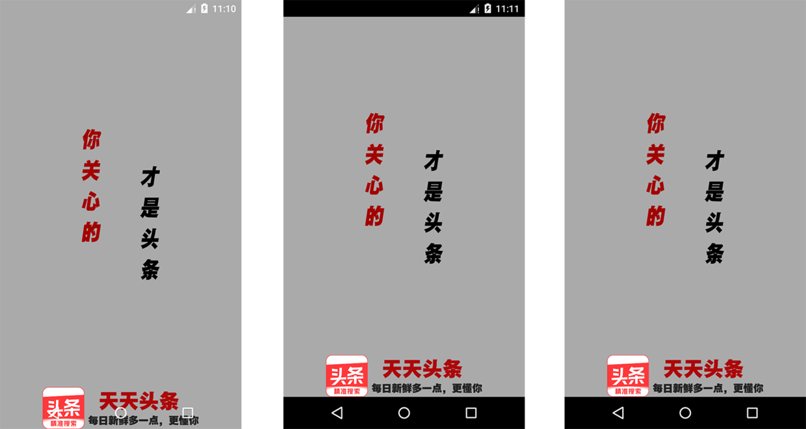
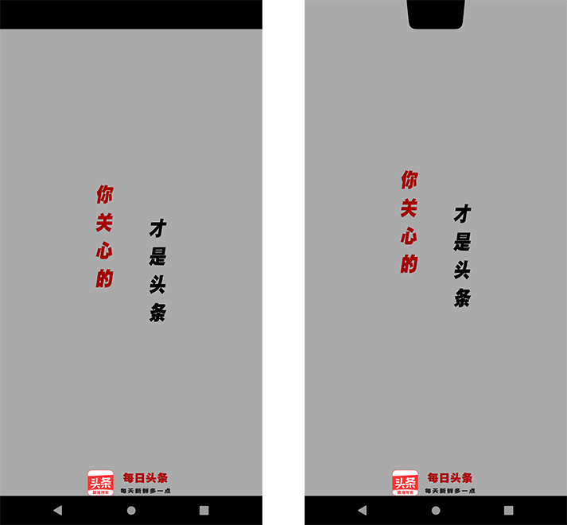

# 前言

android 启动时会显示一个 白色 或 黑色 的启动背景，在 app 界面成功加载后，启动背景被 app 界面覆盖。

若 app 启动时，没有什么耗时的异步操作，可以秒载入界面，那么就没必要继续往下看了，因为没必要弄一个启动屏，但如果启动后需要初始化一些信息才能显示界面，期望在异步载入时显示一个自定义欢迎屏，请继续

# 方案一

做一个静态 activey 欢迎页，在开始加载主界面前，立即显示这个 activey 覆盖在主界面上，待主界面准备好之后，移除这个 activey，比如 [react-native-splash-screen](https://github.com/crazycodeboy/react-native-splash-screen) 、[react-native-bootsplash](https://github.com/zoontek/react-native-bootsplash) 就是采用的这种方案。

但这带来一个问题，就是这个欢迎页本身的绘制也需要时间，虽然非常快，但启动时显示的仍然是白色启动背景。如果 activey 欢迎页本身也是白色背景，视觉上是渐进的，倒也问题不大，但如果欢迎页背景为其他颜色，这个白色闪屏就非常明显了。消除白屏的其中一个方法是在 `android/app/src/main/res/values/styles.xml` 进行如下设置

```
<resources>
    <style name="AppTheme" parent="Theme.AppCompat.Light.NoActionBar">
         .....
         <!--启动背景改为透明-->
         <item name="android:windowIsTranslucent">true</item>
    </style>
</resources>
```

经过上面的修改，没有启动白屏了，但会发现，点击 app 图标后，会有一下停顿感，然后显示欢迎屏。其实很好理解，这个停顿感其实就是正在显示透明的启动背景，等同于把白屏体验改为停顿感了，体验更差。更好的办法是修改启动背景的颜色，这样效果更好，比如 activey 欢迎页为黑色背景，则可修改启动背景为黑色来避免启动时的白色闪屏

```
<resources>
    <style name="AppTheme" parent="Theme.AppCompat.Light.NoActionBar">
         .....
         <!--启动背景改为黑色-->
         <item name="android:windowBackground">#ff000000</item>
    </style>
</resources>
```

# 方案二

上面使用 activey 做启动屏的好处是，可以进行编程，实现较为复杂的甚至是带动画的界面，但正如上述，绘制 activey 本身也是需要时间的，所以点击 APP 图标后的第一眼是一个纯色背景，之后才会加载上启动屏，有延迟感。如果启动屏图案为彩色，无法通过配置完美解决视觉上的闪屏问题。

还有一种方案，既然 app 启动瞬间显示的是启动背景，那么直接美化启动背景，当做欢迎屏不就可以了嘛，这样就完全不存在启动时的等待时间，点开瞬间即显示。同样是修改 `android/app/src/main/res/values/styles.xml`，改为下面这样

```
<resources>
    <style name="AppTheme" parent="Theme.AppCompat.Light.NoActionBar">
        ...
        <!--设置启动背景为一个资源文件-->
        <item name="android:windowBackground">@drawable/splash_screen</item>
    </style>
</resources>
```

创建启动背景资源文件 `@drawable/splash`，保存路径为 `android/app/src/main/res/drawable/splash_screen.xml`

```
<?xml version="1.0" encoding="utf-8"?>
<layer-list xmlns:android="http://schemas.android.com/apk/res/android">
    <item><color android:color="#ffffff"/></item>
    <item>
        <bitmap
            android:antialias="true"
            android:filter="true"
            android:gravity="center" 
            android:src="@drawable/splash_img"/>
    </item>
</layer-list>
```

启动背景作为开屏图有以下特点，若满足要求，推荐此方案：

1. 劣势：这是一个类似于 Canvas 绘图逻辑的资源文件，支持的 [绘图方式](https://developer.android.com/guide/topics/resources/drawable-resource) 较为有限，无法实现较为复杂的启动屏，通常就是直接插入图片。

2. 上例中第一个 `item` 用来设置背景颜色，因为 android 有众多分辨率，若启动背景图较小，无法覆盖满整个屏幕，可设计启动图片的边缘为纯色，和所设置背景颜色自动衔接即可。

3. `@drawable/splash_img` 指定启动背景图，参考 [android不同分辨率适配](https://www.jianshu.com/p/4d49f0cdbfcd)，`drawable` 文件可以创建一个，也可以创建多个，当屏幕分辨率对上号了，优先使用最匹配的 `drawable`，若匹配不上，则会自动选用最接近的一个，并按照比例进行缩放；
   
    一般情况下，只需针对最大像素密度（当前为 `drawable-xxxhdpi`）制作一张图片即可，当用户分辨率小时，会使用该图片并自动按照像素密度缩小。但也有可能导致图片锐化，最好测试一下，如果锐化导致图片过于失真，可考虑多制作几张，如 `drawable/splash_img.png` 、`drawable-hdpi/splash_img.png`  等等；

3. [Bitmap配置](https://developer.android.com/guide/topics/resources/drawable-resource#XmlBitmap)，可根据文档自行调整图片位置；若碰到稍微复杂的启动屏，单纯一张图不好搞时，可看看九宫格类型图片（[NinePatchXml](https://developer.android.com/guide/topics/resources/drawable-resource#NinePatchXml)， [.9图片](https://www.jianshu.com/p/3fd048644e3f)） 是否可实现需求。

# 其他启动配置

上述两个方案中仅针对启动背景做了设置（比如设置为透明或指定颜色/资源），除此之外，还有一些其他的常用设置，下面也做个简单的介绍，某些配置项有版本限制，可根据以下规则进行配置：

- 无 API 版本限制的在 `android/app/src/main/res/values/styles.xml` 中配置
- 有 API 版本限制在 `values-v(n)` 文件夹下配置，比如最低 API Level 19，在 `android/app/src/main/res/values-v19/styles.xml` 中配置
- 如  API Level 19 仍需要通用配置的话，需将配置从 `/values/styles.xml` 复制到 `values-v19/styles.xml`，换句话说，每个配置都是独立的，而不是继承。

```
<resources>
    <style name="AppTheme" parent="Theme.AppCompat.Light.NoActionBar">

          <!--
             通用: 全屏显示，状态栏不显示，启动背景显示到最顶端。
             但对于有刘海屏的机器，状态栏会变成一个无字的大黑边，
             对于有虚拟导航栏的手机，虚拟导航栏以浮动的状态位于底部，
             即启动背景最下方会被导航栏覆盖
          -->
          <item name="android:windowFullscreen">true</item>

           <!--
             API 27: 在 windowFullscreen 开启后，通过该设置可去除刘海屏手机顶部的大黑边
             启动背景将显示到手机的最顶端。
           -->
          <item name="android:windowLayoutInDisplayCutoutMode">shortEdges</item>
          
           <!--
             API 21:  在 windowFullscreen 开启后，通过该属性设置为 false
             启动背景最低端 为 导航栏上沿，即导航栏不会覆盖启动背景了
             低版本无法使用，不过低版本 android 那会，好像还没有虚拟导航栏
           -->
          <item name="android:windowDrawsSystemBarBackgrounds">false</item>


          <!--
              API 19:  状态栏/虚拟导航栏 半透明，开启后，将以半透明背景的状态浮动在顶/底部
              1. 不能与 windowFullscreen=true 同时使用，因为状态直接不显示了，该设置无意义
              2. 对于有刘海屏的，状态栏与刘海齐平，启动背景显示在状态栏（包括刘海）下方
              3. 不支持 windowDrawsSystemBarBackgrounds 设置，启动背景总是铺满全屏
           -->
         <item name="android:windowTranslucentStatus">true</item>
         <item name="android:windowTranslucentNavigation">true</item>

   
          <!--
              API 21:  状态栏/虚拟导航栏 完全透明
              1. 同样的，不能与 windowFullscreen=true 同时使用，理由同上
              2. 也不能与 windowTranslucentStatus / windowTranslucentNavigation 同时使用
                   优先级低于上述属性，同时使用，这里将不生效
              3. 对于有刘海屏的，刘海区域也属于启动背景的可用区域，即启动背景铺满全屏
           -->
         <item name="android:statusBarColor">@android:color/transparent</item>
         <item name="android:navigationBarColor">@android:color/transparent</item>


           <!--
              API 23 / 27:  状态栏/虚拟导航栏 是否启用浅色模式（指背景浅色），文字为深色
              1. windowLightStatusBar 要求 API 23，windowLightNavigationBar 要求 API 27
              2. 使用半透明 状态栏/导航栏 ，该设置没什么必要性
              3. 使用完全透明的 状态栏/导航栏， 可根据启动背景色调进行设置
           -->
          <item name="android:windowLightStatusBar">true</item>
          <item name="android:windowLightNavigationBar">true</item>

    </style>
</resources>
```

# 推荐配置

可使用以下方案来尽可能兼容各版本 Android（值得注意的是，RN 在 0.64 之后 已不再支持 5.0 版本（API 21）以下了，目前或许还可运行，以后将不再维护，毕竟只有2%左右的占有率，无需花费太多精力），以下路径均在 `android/app/src/main/res` 目录下：

1.  `/values/styles.xml`：中仅设置启动背景就好了，状态栏/导航栏保持默认，兼容特低版本(低于 4.4)
```
<resources>
    <style name="AppTheme" parent="Theme.AppCompat.Light.NoActionBar">
        ...
        <item name="android:windowBackground">@drawable/splash_screen</item>
    </style>
</resources>
```

2.  `/values-v19/styles.xml`：Android4.4 及以上，状态栏半透明/导航栏默认

```
<resources>
    <style name="AppTheme" parent="Theme.AppCompat.Light.NoActionBar">
        ...
        <item name="android:windowBackground">@drawable/splash_screen</item>
        <item name="android:windowTranslucentStatus">true</item>
    </style>
</resources>
```

3.  `/values-v21/styles.xml`：Android5.0 及以上，状态栏完全透明/导航栏默认，文字为白色。

```
<resources>
    <style name="AppTheme" parent="Theme.AppCompat.Light.NoActionBar">
        ...
        <item name="android:windowBackground">@drawable/splash_screen</item>
        <item name="android:statusBarColor">@android:color/transparent</item>
    </style>
</resources>
```
4. `/values-v23/styles.xml`：Android6.0 及以上，状态栏完全透明，可设置文字为黑色，当启动屏为浅色时建议设置

```
<resources>
    <style name="AppTheme" parent="Theme.AppCompat.Light.NoActionBar">
        ...
        <item name="android:windowBackground">@drawable/splash_screen</item>
        <item name="android:statusBarColor">@android:color/transparent</item>
        <item name="android:windowLightStatusBar">true</item>
    </style>
</resources>
```

# 测试方案一

上面的配置同时适用于方案一二，使用方案一测试一下，即使用 activey 作为启动页。修改上面配置中的资源文件
 `<item name="android:windowBackground">@drawable/splash_screen</item>` 为颜色值
 `<item name="android:windowBackground">@android:color/darker_gray</item>`

新增一个 `layout/splash_layout.xml`，代码如下

```
<?xml version="1.0" encoding="utf-8"?>
<LinearLayout xmlns:android="http://schemas.android.com/apk/res/android"
    android:layout_width="match_parent"
    android:layout_height="match_parent">

    <ImageView
        android:contentDescription="@android:string/unknownName"
        android:layout_width="match_parent"
        android:layout_height="wrap_content"
        android:layout_gravity="center"
        android:antialias="true"
        android:filter="true"
        android:translationY="0dp"
        android:src="@drawable/splash_img" />
    
</LinearLayout>
```

在 `MainActivity.java` 中加载 xml 

```
...
 @Override
  protected void onCreate(Bundle savedInstanceState) {
    super.onCreate(savedInstanceState);
    // 这里仅为了测试显示效果，直接加载 layout/splash
    // 若实际使用, 应该在这之前, 在 ContentVIew 上层显示 layout/splash
    setContentView(R.layout.splash_layout);
  }
...
```
最终效果图如下（红色横线是后期加上去的），启动屏显示的位置在红线之间，即可用区域内，LOGO 居正中。通常情况下，我们一般希望图片在垂直方向略微偏上，而不是完全上下居中，有两种方法：
- 可根据图片高度修改上面的偏移数字，比如将 `android:translationY="0dp"` 改为  `android:translationY="-40dp"`
- 直接设置垂直居顶 `android:layout_gravity="top"` 同时设置 `android:translationY="136dp"`




# 测试方案二

取消上述 `android:windowBackground` 属性的修改，仍使用启动背景作为启动屏方案，新增启动背景 `/drawable/splash_screen.xml`，代码如下：

```
<?xml version="1.0" encoding="utf-8"?>
<layer-list xmlns:android="http://schemas.android.com/apk/res/android">
    <item><color android:color="#aaa"/></item>
    <item android:bottom="0dp">
        <bitmap
            android:antialias="true"
            android:filter="true"
            android:gravity="center" 
            android:src="@drawable/splash_img"/>
    </item>
</layer-list>
```
 此时效果图如下，启动背景的显示区域在红线之间，在不同版本的或不同手机上显示效果不同。同理的，如希望图片在垂直方向上稍微偏上，也可使用下面两种方法
- 修改上面 `bitmap` 所在的 `item` 属性，比如将  `android:bottom="0dp"` 修改为 `android:bottom="30dp"`
- 修改 `bitmap` 垂直位置为 `android:gravity="top|center_horizontal"`，`item` 偏移改为 `android:top="136dp"`



# 启动图尺寸

上述例子是启动屏的常见形式，显示效果还可以，从设计的角度讲，只需把控启动图的尺寸即可取得不错的观感。当下 Android 最大 DPI 为 xxxhdpi (> 640DPI)，所有 DPI 可参考 [官方文档](https://developer.android.com/training/multiscreen/screendensities?hl=zh-cn#TaskProvideAltBmp)，由于上述 XML 代码已经设置了缩放图片时消除锯齿，平滑过渡，所以为了维护方便，一般情况下，只需提供最大尺寸图片，DPI 较低的手机会自动使用该图进行缩放，即只需添加 `drawable-xxxhdpi/splash_img.png` 一张图片即可，图片尺寸则可以按照以下规则进行设计。

上面演示的图片宽度为 384px，保存在 `drawable-xxxhdpi` 目录，那么图片在 640DPI 的手机上将显示为实际尺寸(384px)，其他 DPI 手机上的显示宽度计算公式为 `显示宽度 = 384 * 手机DPI / 640`，上面演示所用模拟器的分辨率为 1440，DPI 为 560，所以实际显示尺寸为 `384 * 560 / 640 = 336`，经测量，符合预期。一般情况下，手机 DPI 和 分辨率相对固定（可 [参考](https://uiiiuiii.com/screen/)），按照上述公式可算得，384px 的启动图实际显示尺寸大概有如下关系

|  限定符   | DPI   | 分辨率  | 图片显示尺寸 | 启动图宽占比 |
|  ----  | ---- | ----   | ----   | ----   |
| xxxhdpi  | 640～  | 1440 * 2560+ | 384 | 0.27 |
| xxhdpi   | 480～640   | 1080 * 1920+ | 288～384 | 0.27 ～ 0.36|
| xhdpi     | 320～480     | 720 * 1280+ | 192～288 | 0.27 ～ 0.4   |
| hdpi       |  240～320    | 480 * 800+ | 144 ～192 | 0.3 ～ 0.4 |
| mdpi      | 160～240      | 320 | 96 ～144| 0.3 ～ 0.45 |
| ldpi        |  120～160     | 240 | 72 ～96 | 0.3 ～ 0.4 |

通常情况下，无需考虑后三个了，这么老的手机基本被淘汰了（可 [参考](https://tongji.baidu.com/research/app)），最终可得出大概结论，在 `xxxhdpi` 密度下的开屏 LOGO 如果为 `384px`，那么宽度占比约为 `30%`，可根据设计需要依此为依据进行调整，比如取 `512px`，那么宽度占比约为 `512/384 * 30% = 40%`

# 上下图启动屏

上述启动图较为简单，除上述启动图之外，还有两种较为常见的启动图形式：
1. 仅有一张启动 LOGO 图，放在屏幕底部。
2. 有两张启动图，上面一张较大的，底部一张稍小的。

二者与一张居中图的主要区别在于会有图片放在屏幕底部，底部的图就不那么简单了，有兼容性问题，这里选用上下启动图进行测试以作说明。仍然按照上述思路，先使用 activey 作为启动页，经测试，这种方案没有问题，无需多说，`layout/splash_layout.xml` 代码和效果图如下：

```
<?xml version="1.0" encoding="utf-8"?>
<LinearLayout xmlns:android="http://schemas.android.com/apk/res/android"
    android:layout_width="match_parent"
    android:layout_height="match_parent"
    android:orientation="vertical"
    >
    <LinearLayout
        android:layout_width="match_parent"
        android:layout_height="0dp"
        android:layout_weight="1"
        android:layout_gravity="center"
        >
        <ImageView
            android:contentDescription="@android:string/unknownName"
            android:layout_width="match_parent"
            android:layout_height="wrap_content"
            android:layout_gravity="center"
            android:antialias="true"
            android:filter="true"
            android:translationY="-30dp" 
            android:src="@drawable/splash_top"/>

    </LinearLayout>

    <ImageView
        android:contentDescription="@android:string/unknownName"
        android:layout_width="match_parent"
        android:layout_height="wrap_content"
        android:antialias="true"
        android:filter="true"
        android:translationY="0dp"
        android:src="@drawable/splash_bottom" />
</LinearLayout>
```


再试一下使用启动背景的方案，`/drawable/splash_screen.xml` 代码和效果图如下：

```
<?xml version="1.0" encoding="utf-8"?>
<layer-list xmlns:android="http://schemas.android.com/apk/res/android">
    <item><color android:color="#aaa"/></item>
    <item android:top="-30dp">
        <bitmap
            android:antialias="true"
            android:filter="true"
            android:gravity="center"
            android:src="@drawable/splash_top" />
    </item>
    <item android:top="0dp">
        <bitmap
            android:antialias="true"
            android:filter="true"
            android:gravity="bottom|center_horizontal"
            android:src="@drawable/splash_bottom" />
    </item>
</layer-list>
```



可见效果图是符合逻辑的，但却不符合期望效果。在 Android4.4 以上的非全面屏手机上，下图会被导航栏覆盖，如果对下图显示的位置不那么在意，可以给 `/drawable/splash_screen.xml` 下图所在的 `item` 修改为 `android:bottom="48dp"`，因为通常情况下，导航栏的高度为 `48dp`，这样可以让下图也能显示出来，但这也会带来两个问题：

1.  Android4.4 以下和全面屏，下图也会向上移动 48dp，设计感可能会不如预期。
2. 并非所有手机的导航栏高度都一定为 48dp，为了保险起见，可能还需要加大该数值。

若无法接受这种方案，还有一种解决方案是修改 `styles.xml`。因为只有在 Android4.4 以上才有此问题，所以保持 `/values/styles.xml` 和 `/values-v19/styles.xml` 不变，只需修改 `/values-v21/styles.xml` 即可（如果设置了 `values-v23` 也要同时修改），可以从上面介绍的启动配置中选择的合适的进行设置，有三种常见的方案

```
<resources>
    <style name="AppTheme" parent="Theme.AppCompat.Light.NoActionBar">
        ...
        <!--状态栏/导航栏都设置为透明-->
        <item name="android:windowBackground">@drawable/splash_screen</item>
        <item name="android:statusBarColor">@android:color/transparent</item>
        <item name="android:navigationBarColor">@android:color/transparent</item>
    </style>
</resources>

<resources>
    <style name="AppTheme" parent="Theme.AppCompat.Light.NoActionBar">
        ...
        <!--状态栏/导航栏不属于背景区域，由系统接管-->
        <item name="android:windowBackground">@drawable/splash_screen</item>
        <item name="android:windowDrawsSystemBarBackgrounds">false</item>
    </style>
</resources>


<resources>
    <style name="AppTheme" parent="Theme.AppCompat.Light.NoActionBar">
        ...
        <!--导航栏不属于背景区域，由系统接管；状态栏不显示-->
        <item name="android:windowBackground">@drawable/splash_screen</item>
        <item name="android:windowDrawsSystemBarBackgrounds">false</item>
        <item name="android:windowFullscreen">true</item>
    </style>
</resources>
```

三种配置的效果图如下：
- 第一种方案对全面屏手机友好（本来就没有导航栏，还可以显示状态栏），但对于有导航栏的显示效果就会如下图所示；
- 第二种头部的状态栏无法自定义设置，总是为黑边，通常不使用这一种，不好看；
- 第三种是大部分APP选择的方式，可以兼顾全面屏和有导航栏的，缺点是在冷启动瞬间不显示状态栏，在 APP 加载成功后需通过代码动态显示状态栏。因为状态栏被隐藏，这样也无需设置 `values-v23` 了。
- 上述也不是绝对的，比如启动背景为一张全屏的大背景图，此时使用第一种方案可能会更友好一点。



细心的朋友应该看出来上述截图没有使用刘海屏手机，这是因为第三种方案对于刘海屏不友好，由于 `android:windowDrawsSystemBarBackgrounds` 的配置，状态栏会变成一个大黑边（参见上面的启动配置介绍），需要新增一个 `/values-v27/styles.xml` (Android 8.1 及以上) 用以适配全面屏，配置如下
```
<resources>
    <style name="AppTheme" parent="Theme.AppCompat.Light.NoActionBar">
        ...
        <!--导航栏不属于背景区域，由系统接管；状态栏不显示-->
        <item name="android:windowBackground">@drawable/splash_screen</item>
        <item name="android:windowDrawsSystemBarBackgrounds">false</item>
        <item name="android:windowFullscreen">true</item>
        <!--在 v21 基础上新增刘海设置-->
        <item name="android:windowLayoutInDisplayCutoutMode">shortEdges</item>
    </style>
</resources>
```



上述应该算作较为完美的处理启动屏的方案了，如果希望上图位置向上偏移，可参考上面只有一张居中图的说明。最后剩下一个小问题，隐藏的状态栏应该在 App 主界面加载完毕后显示出来才好，对于 RN 可以使用下面的方法，原生开发可参考 RN 的 [实现](https://github.com/facebook/react-native/blob/main/ReactAndroid/src/main/java/com/facebook/react/modules/statusbar/StatusBarModule.java)

```
import { StatusBar } from 'react-native';

StatusBar.setHidden(false);
StatusBar.setTranslucent(false);
StatusBar.setBackgroundColor('#000');//transparent
```

由于启动图是使用 Window 窗口背景实现的，当主界面加载后，会自动覆盖背景图，无需继续处理也没什么影响。但可以考虑在加载完毕后，清除 Window 窗口背景，这样也许可释放一些图片占用的内存（未测试），由于属于能做则做，不做也行的范畴，就不多说了。

继续阅读：

[iOS 启动屏](ios.md)

[React Native 启动屏](react.md)
