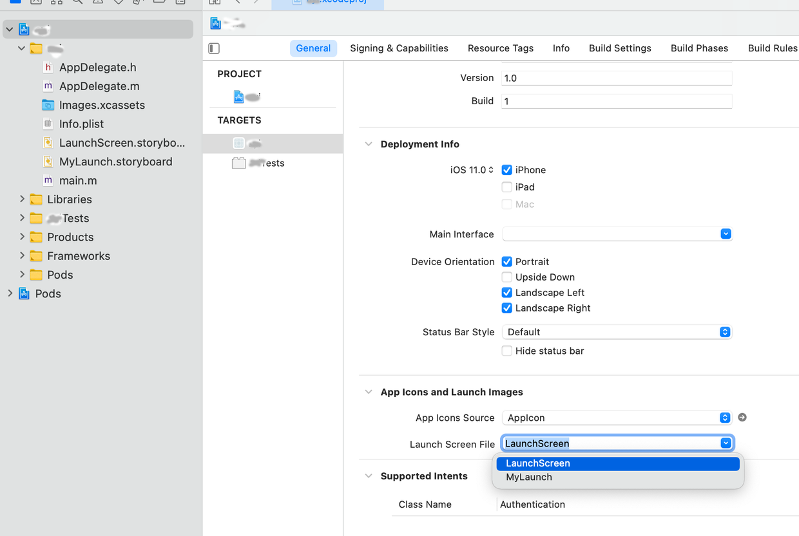

# 前言

新版 iOS 使用 `.storyboard` 文件作为启动屏文件，RN 自带了一个 [启动屏](https://github.com/facebook/react-native/blob/main/template/ios/HelloWorld/LaunchScreen.storyboard)，在项目中的路径为 `ios/[project]/LaunchScreen.storyboard`，如果可以接受纯文字格式的启动屏，打开这个文件修改文字即可。若需要自定义，可通过 xcode 进行可视化编辑：

### 第一步

添加启动图所需的图片，如果需要支持 dark mode，且图片不适配 dark mode，可修改选项，额外添加用于支持 dark mode 的适配图片。


### 第二步

下图标注序号的地方为主要操作区域，作用如下

1. 点击 + 号按钮，拖拽 `UIImageVIew` 到屏幕窗口。
2. 选择要编辑的图层或约束条件
3. 设置当前选中图层的属性
4. 添加约束条件


### 第三步

若直接编辑 `LaunchScreen.storyboard` 则无需进行这一步，为 RN 默认配置。若新建一个 `.storyboard` 文件，最后可通过以下方式修改启动屏所用文件。



# 设计

下面演示两种常见的启动屏的设计方式(一张居中图、上下各一张图)


### 启动图尺寸

iOS 与 Android 类似，也存在不同的分辨率和 DPI ，为了维护方便，也可以仅设置最大图（@3x） 即可，图片的实际显示尺寸可参见 [Android 启动屏](android.md) 中 `启动图尺寸` 章节的计算方法 和 不同版本 iPhone 的 [分辨率](https://www.ios-resolution.com/)，这里就不再累述了。

### 启动图瑕疵

启动屏在某些 iOS 版本存在一定的 [瑕疵](https://developer.apple.com/forums/thread/68244)：修改图片再次启动不生效，仍会显示上次的图片，可以尝试修改图片名称，并修改 `.storyboard` 中的引用，这个实际使用时要注意测试一下。

# 与 Android 的不同之处

相比 [Android 启动屏](android.md)，iOS 启动屏类似于 Android 使用 activey 作为启动屏的方案，而没有启动背景的方案。这意味着可以有更好的灵活度，可以制作更加复杂的效果（上面只是最简单的介绍，更多玩法需自行探索）。并且该启动屏会在主页面加载成功后自动移除，并替换为主界面，移除发生在 `AppDelegate.m` 中的 `didFinishLaunchingWithOptions` 函数执行后

```
- (BOOL)application:(UIApplication *)application didFinishLaunchingWithOptions:(NSDictionary *)launchOptions
{
    .....

    // 该函数处理完毕后返回结果，此时启动屏移除屏幕
    return YES;
}
```

该过程发生在主线程，在处理该逻辑的同时，RN 会同步加载并执行 JS 线程。若在主线程处理完毕、启动屏移除时，JS 线程还未处理完毕（即主界面未完成渲染），此时会显示为白屏。

一般情况下，若 JS 线程在启动时没有任何异步任务，直接在 `render` 返回界面，倒也问题不大，几乎不会出现白屏的情况，但如果 JS 在启动时执行一些异步请求，之后才 `render` 界面，那么这个白屏就很难受了。

所以对于 RN 而言，直接使用 `.storyboard` 作为启动屏并不完美，启动时无法在 JS 中处理异步任务，比如以下两个组件也对此做了修改。

[react-native-splash-screen](https://github.com/crazycodeboy/react-native-splash-screen) 的方案是，使用 `NSRunLoop` 方法阻塞主线程，等待 JS 线程加载完毕的通知，待收到通知后，跳出阻塞，移除启动屏，显示主界面。

[react-native-bootsplash](https://github.com/zoontek/react-native-bootsplash) 的方案是，在未移除启动屏前，使用启动屏创建一个页面插入到主界面上方，该页面与启动屏完全一样，虽然之后启动屏按预期移除，但整个过程视觉上是没有任何变化的。待主界面加载完毕，JS 线程发送通知，此时移除覆盖在主界面上的层，显示主界面。

二者都需要在 `AppDelegate.m` 添加相应的代码

```
- (BOOL)application:(UIApplication *)application didFinishLaunchingWithOptions:(NSDictionary *)launchOptions
{
    .....
   
    // react-native-splash-screen 需再此调用函数阻塞主线程，收到通知后跳出循环

    // react-native-bootsplash 在此调用函数，即启动屏移除前，使用启动屏创建一个页面

    // 该函数处理完毕后返回结果，此时启动屏移除屏幕
    return YES;
}
```

这两种方式，第二种要更好一点，阻塞主线程不是一个好主意。之所以能够在 RN 上使用，是因为 RN 的 JS 单独使用了一个线程，如果为原生开发，阻塞主线程就死循环了。即使对 RN 而言，也最好不要使用这种方式，因为可能有其他第三方组件需要在主线程执行一些任务。

对于第二种方式，如果将启动屏创建的页面插入到主界面下面，这样就与使用 Android 启动背景的逻辑一致了，主界面渲染完毕后会自动覆盖启动屏，哪怕不移除这个复制的层也没什么影响。`react-native-splashbg` 便是使用这种方式。

# 插件开发

无论是 `react-native-splash-screen` 还是 `react-native-bootsplash`，都需要修改 `AppDelegate.m` 中的代码，有没有办法开发一个组件避免这一步，让组件更加绿色纯净，安装卸载组件都无需对项目做什么修改。参考 [RN与iOS原生通信原理](https://blog.gaogangsever.cn/react/ReactNative%E4%B8%8EiOS%E5%8E%9F%E7%94%9F%E9%80%9A%E4%BF%A1%E5%8E%9F%E7%90%86%E8%A7%A3%E6%9E%90-%E5%88%9D%E5%A7%8B%E5%8C%96.html)，根据加载流程可以发现，如果想在 `didFinishLaunchingWithOptions` 返回结果前加载组件，需要实现自定义的 `BridgeModule`，这样可以 [注入依赖](https://reactnative.dev/docs/native-modules-ios#dependency-injection)，但这种方法也需要修改 `AppDelegate.m`，并且实现起来还比较麻烦，pass 掉。

既然 RN 没有预留相关接口，试试 iOS 的通知系统，看看有没有可以利用的回调接口，可以用下面的方法查看启动过程中的所有通知：

```
NSNotificationCenter *notifyCenter = [NSNotificationCenter defaultCenter];
[notifyCenter addObserverForName:nil
                            object:nil
                            queue:nil
                        usingBlock:^(NSNotification *notification){
    NSLog(@"Notification found with:"
            "\r\n     name:     %@"
            "\r\n     object:   %@"
            "\r\n     userInfo: %@",
            [notification name],
            [notification object],
            [notification userInfo]);
}];
```

最终发现在 `didFinishLaunchingWithOptions` 返回结果前，产生了一个名为 [`UIWindowDidBecomeVisibleNotification`](https://developer.apple.com/documentation/uikit/uiwindowdidbecomevisiblenotification) 的通知，查看文档发现这个有用，剩下的就是一些细节处理了，最终可通过这个思路实现一个绿色启动屏组件。

继续阅读：

[Android 启动屏](android.md)

[React Native 启动屏](react.md)
