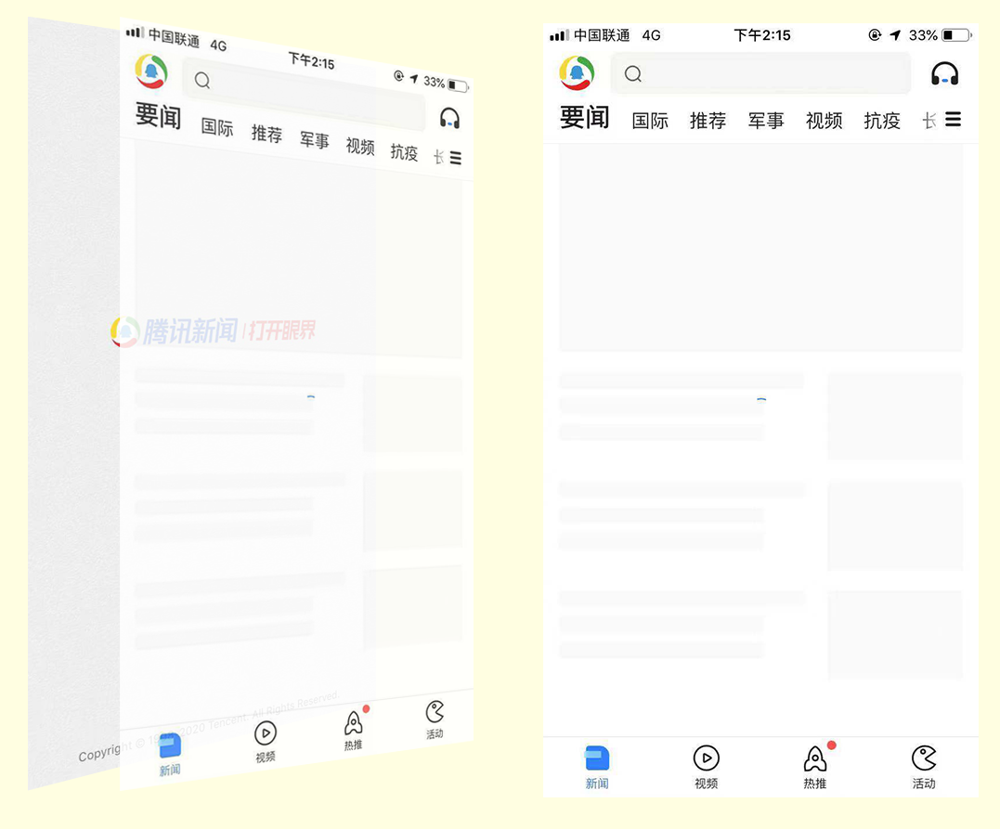

通过 [Android 启动屏](android.md)、[iOS 启动屏](ios.md) 的介绍知道，可以采用窗口背景图的方式统一启动屏逻辑，其实原生的启动屏严格来讲并不能叫做启动屏，而应该叫做闪屏，这个界面并不是用来炫技或展示重要信息的，仅仅作为渲染主界面前，替代白屏，来减轻用户焦虑的，不应使用动画，或倒计时之类的东西。闪屏之后，即冷启动后应该尽快显示主界面，根据这个逻辑，下面举例说一下 RN 处理的常用形式：

# 全局信息加载

一般情况下，冷启动时，需要加载一些全局信息，比如配置信息、用户信息等来完成初始化。若在初始化成功前，无法渲染页面、或者不希望用户看到界面，那么 `render` 函数返回 `null` 即可，之后再根据初始化结果显示相应页面，伪代码演示：

```
export default class extends React.Component {
  state = {
    info: null
  }
  
  componentDidMount() {
    // 异步完成初始化
    doAsyncWork().then(rs => {
      this.setState({
        info:rs
      });
    }).catch(e => {
      this.setState({
        info:false
      });
    })
  }

  index() {
    return <View>
          <Header />
          <List />
    </View>;
  }

  error() {
    return <Error />;
  }

  render(){
    if (null === this.state.info) {
      return null;
    }
    if (false === this.state.info) {
      return this.error();
    }
    return this.index();
  }
}
```


# 渐进式加载

假设 `index()` 中的 `Header` 组件是打包到客户端的静态组件，无需网络请求，而 `List` 需要网络请求内容后才显示，那么可以先展示能展示的，不能展示的渐进式加载展示，即初始化完成后，直接显示首页，渐进的显示首页所有内容。



# 使用开屏广告

既然首页直接展示也无法立即展示内容给用户，可以利用这个时间空档展示一个可跳过的广告

```
export default class extends React.Component {
  ...

  index() {
    return <View>
          <Header />
          <List />
          <Ad style={{...StyleSheet.absoluteFill}} />
    </View>;
  }

  ...
}
```
在 index 页面上完整覆盖一个可跳过广告组件，其他一切保持默认即可。因为在广告自动关闭或用户手动关闭后（`Ad` 组件返回 `null` 即等同于关闭广告），首页是否加载完毕并不重要，如果加载完毕，展示给用户的是一个完整的首页，否则就等同于降级为渐进式加载的首页。


# 完整加载

如果没有开屏广告，或者就想在闪屏之后，直接让用户看到渲染完毕的首页，也不是没有办法，比如可以设置首页为透明状态，正常渲染，渲染完毕后显示，伪代码演示：

```
export default class extends React.Component {
  ...
  
  _indexRef = React.createRef();
  onShow = () => {
    this._indexRef.setNativeProps({
      opacity: 1
    });
  }

  index() {
    // List 组件提供一个渲染完毕的回调接口
    return <View style={{opacity:0}}  ref={this._indexRef}>
          <Header />
          <List onShow={this.onShow} />
    </View>;
  }

  ...
}
```


以上只是 RN 冷启动的一些常用方式，但并不代表必须这么做，权当是抛砖引玉了。